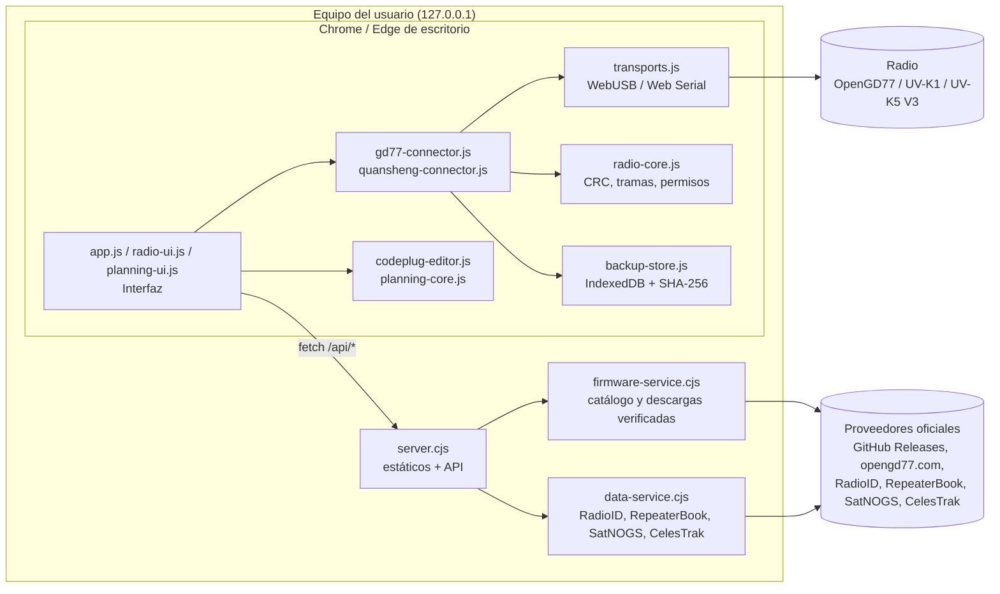
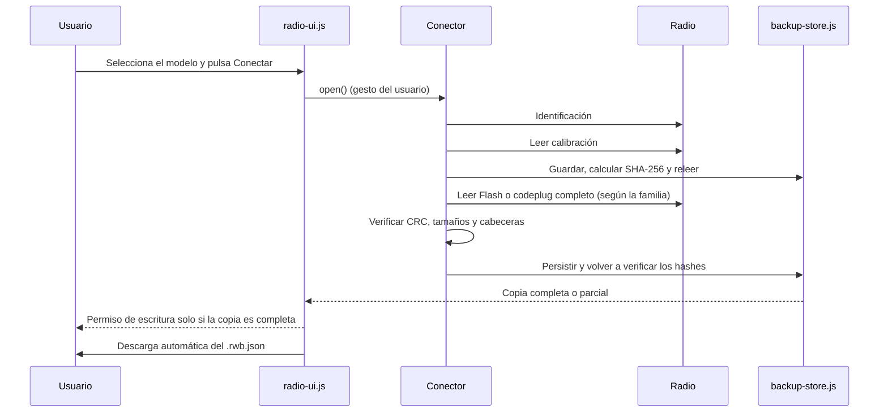
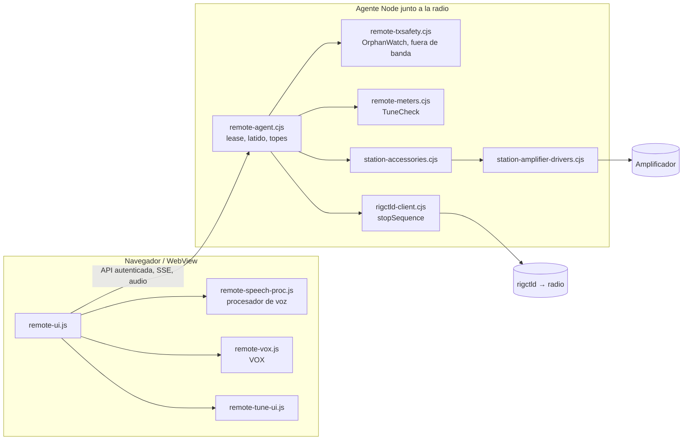

# Architettura di Bricohams Radio Workspace

Bricohams Radio Workspace è un'applicazione web **locale**. Un piccolo server Node.js serve un elenco chiuso di file statici e poche API di sola lettura. La comunicazione con la radio per i connettori di firmware, codeplug e backup avviene nel browser tramite WebUSB o Web Serial. Il controllo remoto via CAT è un componente a parte (vedi [Stazione remota](#stazione-remota-e-sicurezza-tx)): un agente accanto alla radio e una console che si collega ad esso.

## Modalità di esecuzione

All'avvio, `runtime-mode.js` richiede `runtime.json` (percorso relativo, senza cache). Solo `{"mode":"local"}` attiva la modalità locale; se manca, restituisce 404, non è JSON o la pagina viene aperta come `file://`, l'applicazione parte in **modalità web** senza errori. `server.cjs` lo serve come `{"mode":"local"}` e `scripts/build-pages.cjs` genera `{"mode":"web"}` in `dist/`. Il badge superiore indica «Web · GitHub Pages» o «Locale · installato».

| Aspetto | Web (Pages) | Locale |
| --- | --- | --- |
| Server | Nessuno, solo file statici | `server.cjs` su `127.0.0.1:8787` |
| Firmware F4HWN / ARDF K1-K5 V3 | Cronologia stabile da Armel e reald tramite `api.github.com`; l'utente carica il file e vengono verificati dimensione e SHA-256 pubblicato | Download verificato dal server; ARDF, versioni precedenti alla v6 e SA818 solo per il download |
| Firmware OpenGD77 | Caricamento manuale dello ZIP (nome e firma ZIP; senza hash dell'editore) | Download tramite il server |
| RadioID | Caricamento di `user.csv` (100 MiB, filtrato, 5.000 righe mostrate) e profilo facoltativo in `localStorage` | API tramite server |
| RepeaterBook | Non disponibile | Token approvato, solo sul server |
| Satelliti | `data/satellites.json` giornaliero (`scripts/fetch-satellites.cjs`) | TLE in tempo reale |

I percorsi del client sono sempre relativi. La CSP di ogni HTML è dichiarata in `<meta>` e, poiché `<meta>` non supporta `frame-ancestors`, `app.js` si arresta se la pagina è in un frame. Il sito web ha un'origine propria (vedi ADR-013).

## Vista dei componenti

```mermaid
flowchart LR
  subgraph Equipo["Equipo del usuario (127.0.0.1)"]
    subgraph Navegador["Chrome / Edge de escritorio"]
      UI["app.js / radio-ui.js / planning-ui.js<br/>Interfaz"]
      CON["gd77-connector.js<br/>quansheng-connector.js"]
      TR["transports.js<br/>WebUSB / Web Serial"]
      CORE["radio-core.js<br/>CRC, tramas, permisos"]
      CP["codeplug-editor.js<br/>planning-core.js"]
      BK["backup-store.js<br/>IndexedDB + SHA-256"]
    end
    SRV["server.cjs<br/>estáticos + API"]
    FW["firmware-service.cjs<br/>catálogo y descargas verificadas"]
    DS["data-service.cjs<br/>RadioID, RepeaterBook, SatNOGS, CelesTrak"]
  end
  Radio[("Radio<br/>OpenGD77 / UV-K1 / UV-K5 V3")]
  Ext[("Proveedores oficiales<br/>GitHub Releases, opengd77.com,<br/>RadioID, RepeaterBook, SatNOGS, CelesTrak")]
  UI --> CON --> TR --> Radio
  CON --> CORE
  CON --> BK
  UI --> CP
  UI -- "fetch /api/*" --> SRV
  SRV --> FW --> Ext
  SRV --> DS --> Ext
```

## Moduli

| File | Lato | Responsabilità |
| --- | --- | --- |
| `index.html`, `opengd77.html`, `quansheng.html`, `ayuda.html` | Browser | Scheletri delle pagine con `body[data-page]`, senza script inline. |
| `app.js` | Browser | Interfaccia comune (marchio, navigazione, piè di pagina), guide e pagina di aiuto con ricerca. |
| `radio-ui.js` | Browser | Pannello di connessione, backup automatici, cronologia, esportazione e azioni protette. |
| `transports.js` | Browser | `USBTransport` (CDC su WebUSB, `1FC9:0094`) e `SerialTransport` (Web Serial), con lettura esatta e timeout. |
| `radio-core.js` | Browser / Node | CRC-16/CRC-32, utilità binarie, permessi di scrittura e SHA-256. |
| `gd77-connector.js` | Browser | Protocollo OpenGD77 CPS (`C`/`R`/`W`/`X`) e mappe MK22, STM32 e SERIAL. |
| `quansheng-connector.js` | Browser | Protocollo UART F4HWN (offuscamento XOR, CRC), lettura di calibrazione e Flash, slot Multiboot. |
| `backup-store.js` | Browser | Persistenza in IndexedDB, rilettura verificata ed esportazione `.rwb.json`. |
| `codeplug-editor.js` | Browser / Node | Lettura e scrittura binaria del codeplug OpenGD77: canali, contatti e blocco SAT tipo 3. |
| `planning-core.js` | Browser / Node | Filtri, deduplicazione, CSV, validazione TLE e passaggi SGP4 con `satellite.js`. |
| `planning-ui.js` | Browser | Pannello «Codeplug: contatti, ripetitori e SAT». |
| `firmware-catalog.js` | Browser / Node | Modelli e fonti firmware consentiti. |
| `server.cjs` | Node | Server HTTP su `127.0.0.1:8787`, elenco di file consentiti, intestazioni di sicurezza e routing di `/api/*`. |
| `firmware-service.cjs` | Node | Consultazione di GitHub Releases e opengd77.com con reindirizzamenti controllati, limiti di dimensione e cache. |
| `runtime-mode.js` | Browser | Rileva la modalità (`runtime.json`; web se manca). |
| `radioid-csv.js` | Browser / Node | Lettura filtrata di `user.csv` e profilo locale facoltativo. |
| `scripts/build-pages.cjs`, `scripts/fetch-satellites.cjs` | Node | Generano `dist/` e `data/satellites.json` per Pages. |
| `data-service.cjs` | Node | Proxy di sola lettura verso RadioID, RepeaterBook (credenziali solo sul server), SatNOGS e CelesTrak. |
| `remote-station.cjs`, `remote-agent.cjs` | Node | Supervisore di `rigctld`/`rotctld` (usato da `server.cjs` per `/api/remote/*` e dalla modalità headless) e agente del Remote shack. Vedi la sezione seguente. |
| `remote-txsafety.cjs`, `remote-meters.cjs`, `station-amplifier-drivers.cjs` | Node | Protezioni TX (`OrphanWatch`, blocco fuori banda), `TuneCheck` e driver di amplificatore. |
| `remote-speech-proc.js`, `remote-vox.js` | Browser / Node | Processore vocale e VOX del percorso TX remoto (script classici che esportano anche in CommonJS). |
## Flusso di connessione e backup automatico

```mermaid
sequenceDiagram
  participant U as Usuario
  participant UI as radio-ui.js
  participant C as Conector
  participant R as Radio
  participant B as backup-store.js
  U->>UI: Selecciona el modelo y pulsa Conectar
  UI->>C: open() (gesto del usuario)
  C->>R: Identificación
  C->>R: Leer calibración
  C->>B: Guardar, calcular SHA-256 y releer
  C->>R: Leer Flash o codeplug completo (según la familia)
  C->>C: Verificar CRC, tamaños y cabeceras
  C->>B: Persistir y volver a verificar los hashes
  B-->>UI: Copia completa o parcial
  UI-->>U: Permiso de escritura solo si la copia es completa
  UI->>U: Descarga automática del .rwb.json
```

Prima di ogni scrittura, il backup viene riletto e confrontato con gli hash del permesso. Scollegare la radio, sostituirla o eliminare il backup revoca il permesso.

## Stazione remota e sicurezza TX

Il **Remote shack** (`remote-agent.cjs`, console `remote.html` / `remoto.html`) controlla una radio tramite Hamlib `rigctld` ed è indipendente dalla stazione Python di `remote-station/` (vedi [REMOTE_STATION.md](REMOTE_STATION.md)). `server.cjs` non cambia: continua ad ascoltare solo su `127.0.0.1` e delega `/api/remote/*` a `remote-station.cjs`. La mappa completa dei moduli è nella [mappa tecnica](../../MAPA-TECNICO-PROYECTO.md#mapa-de-módulos-diagrama-de-dependencias).

```mermaid
flowchart LR
  subgraph Cliente["Navegador / WebView"]
    UI["remote-ui.js"]
    SP["remote-speech-proc.js<br/>procesador de voz"]
    VX["remote-vox.js<br/>VOX"]
    TUI["remote-tune-ui.js"]
  end
  subgraph Agente["Agente Node junto a la radio"]
    RA["remote-agent.cjs<br/>lease, latido, topes"]
    TXS["remote-txsafety.cjs<br/>OrphanWatch, fuera de banda"]
    MET["remote-meters.cjs<br/>TuneCheck"]
    RC["rigctld-client.cjs<br/>stopSequence"]
    ACC["station-accessories.cjs"]
    AMP["station-amplifier-drivers.cjs"]
  end
  RIG[("rigctld → radio")]
  AMPHW[("Amplificador")]
  UI --> SP
  UI --> VX
  UI -- "API autenticada, SSE, audio" --> RA
  UI --> TUI
  RA --> TXS
  RA --> MET
  RA --> RC --> RIG
  RA --> ACC --> AMP --> AMPHW
```

La console React della stazione Python riutilizza gli stessi `remote-speech-proc.js` e `remote-vox.js` tramite `remote-station/apps/web-console/src/txProcessing.ts`; l'agente Python ha il proprio blocco fuori banda in `remote-station/bricoham_station_agent/txsafety.py`.

### Garanzie TX

Il software non trasmette mai da solo: ogni passaggio in TX è un comando esplicito dell'operatore. Le protezioni dell'agente, verificate in `remote-agent.cjs`:

| Protezione | Comportamento |
| --- | --- |
| PTT off | `pttOff()` ha la precedenza su tutto: termina una sintonia in corso, ferma il CW ed esegue `stopSequence` (arresto del sintonizzatore, `txOff` grezzo e `T 0` di Hamlib, con priorità nella coda). |
| Heartbeat | Senza heartbeat per `HEARTBEAT_TIMEOUT_MS` (1000 ms) l'agente rilascia il PTT e mette l'amplificatore in STANDBY. |
| Limiti di tempo | Limite di TX (`txLimitSeconds`, 180 s per impostazione predefinita) e di sintonia (`TUNE_MAX_SECONDS`: interno 20 s predefiniti e 30 s massimi; ATAS 45 s e 60 s). |
| SWR | Intervento con SWR sostenuto sopra `swrLimit` (3 per impostazione predefinita) o il limite grezzo del profilo CAT; durante la sintonia si usa `TUNE_SWR_MS`. |
| Amplificatore | `accessories.standby("lease")` a ogni perdita di lease o heartbeat; parte in STANDBY e non passa a OPERATE senza condizioni sicure. |
| Fuori banda | `remote-txsafety.cjs`: solo con `txRanges` configurati; una frequenza o un modo sconosciuti bloccano anch'essi un nuovo passaggio in TX. Un errore di lettura isolato non interrompe una emissione in corso. |
| TX orfano | `OrphanWatch`: un'emissione dell'agente senza titolare del lease viene rilasciata dopo due osservazioni consecutive. |
| Blocco operatore | Un solo operatore alla volta (lease); nella console, `view.locked` impedisce le azioni e disarma il VOX. |

Il VOX (`remote-vox.js`) non aggiunge alcun percorso di TX: usa gli stessi `pttDown`/`pttUp` del pulsante, non viene mai salvato e si disarma in caso di rifiuto, caduta dell'agente, perdita di controllo o di collegamento, blocco e pagina nascosta. Il processore vocale (`remote-speech-proc.js`) è disattivato per impostazione predefinita e limita l'uscita a un tetto fisso di −1 dBFS.

### Verifica della sintonia e arresto alla chiusura

- `TuneCheck` (`remote-meters.cjs`; specchio Python in `remote-station/bricoham_remote_station/tune_check.py`) percorre `requested → confirming → tuning → reading → stopping → verifying → done` con gli esiti `success`, `fail`, `timeout` e **`unverified`**. In una sintonia ATAS, se `evidence(false)` indica che la radio non ha mostrato il lavoro del sintonizzatore e l'SWR non è alto, l'esito è `unverified` con il motivo `no-tune-evidence` (nella console: «Sintonia non verificata»); se TX0 non è confermato dalla lettura, diventa `fail` (`tx-stuck`). Un `cut()` non produce mai `unverified`.
- `close()` dell'agente spegne prima il PTT e chiama `settleStopBeforeClose`: attende (con tetto `stopStepMs * 5 + 500` ms) la fine di un arresto in corso e, se non confermato, ripete `stopSequence` una volta prima di rilasciare il client `rigctld`. Poi ferma il CW, esegue `accessories.emergencyStop("close")`, chiude il driver dell'amplificatore e mette in sicurezza i dispositivi della stazione.

I test deterministici (orologi e trasporti simulati) si trovano in `tests/remote-txsafety.test.cjs`, `tests/remote-txaudio.test.cjs`, `tests/remote-amplifier-drivers.test.cjs`, `tests/remote-meters.test.cjs`, `tests/remote-agent.test.cjs` e, in Python, `remote-station/tests/test_tx_inhibit.py` e `test_tune_check.py`. I driver degli amplificatori sono «implementati da fonte, non provati su hardware»: nel repository non esiste una cattura di un amplificatore reale.

## Livelli di sicurezza

1. **Rete:** il server ascolta solo su `127.0.0.1`, richiede `Host: 127.0.0.1:<puerto>` e serve un elenco fisso di file.
2. **Browser:** CSP `default-src 'self'; script-src 'self'; style-src 'self'`, `Permissions-Policy`, `nosniff`, `no-referrer` e `no-store`. Non si usa `eval` né si costruisce HTML con dati della radio.
3. **Apparato:** le scritture usano un permesso *fail-closed* legato a un backup verificato. Main non è mai una destinazione. Cancellazione o ripristino richiedono una conferma digitata.
4. **Fonti esterne:** solo fornitori ufficiali, reindirizzamenti a host consentiti, limiti di dimensione e SHA-256 visibile. Le credenziali RepeaterBook non vengono mai inviate al browser.
5. **Dati:** niente telemetria né caricamenti verso server. I backup rimangono nell'IndexedDB del profilo locale e vengono esportati in file dell'utente.
6. **Trasmissione remota:** TX disattivato per impostazione predefinita, solo su comando esplicito dell'operatore, con le protezioni di [Garanzie TX](#garanzie-tx). Le credenziali del relay restano nell'agente (`~/.radicodex/remote-agent.json`, 0600) e non vengono stampate; il token di accesso viaggia solo nel frammento dell'URL e la console lo rimuove dalla barra degli indirizzi. Le protezioni software non sostituiscono gli interblocchi fisici.

## Documentazione del codice

La documentazione dettagliata del codice e dei test è conservata in file separati:

- [Node: agente e desktop][codigo-node]: server locale, agente Remote shack e console della radice.
- [Python: stazione remota][codigo-python]: host coordinatore e agente di `remote-station/`.
- [Android e console web][codigo-android]: app native e console React/Capacitor.
- [Test e risultati][pruebas]: cosa copre ogni suite e i risultati registrati.

Questi quattro documenti sono scritti in parallelo; se un link non si risolve in una copia specifica del repository, il documento non è ancora stato integrato in quel ramo.

[codigo-node]: ../../codigo/NODE-AGENTE-Y-ESCRITORIO.md
[codigo-python]: ../../codigo/PYTHON-ESTACION-REMOTA.md
[codigo-android]: ../../codigo/ANDROID-Y-CONSOLA-WEB.md
[pruebas]: ../../PRUEBAS-Y-RESULTADOS.md
## Limitazioni note

- **OpenGD77:** qui non esiste un protocollo verificato per estrarre l'intero firmware del MCU. Il backup è contrassegnato come **parziale** e la scrittura sulla radio rimane bloccata.
- **Quansheng:** il backup fisico completo della Flash richiede le capacità di lettura e CRC di F4HWN Labs v6.1+. Il web implementa la scrittura Beta di configurazione/canali con backup e rilettura, e le immagini Bricohams SAT incorporano CAT RX sperimentale. Ciò non dimostra scrittura persistente né funzionamento CAT su una radio specifica; consulta la [matrice di validazione](VALIDACION-INTEGRAL-V3-ANDROID.md).
- **RepeaterBook:** richiede un token approvato da RepeaterBook ed è presente solo nella versione locale.
- **Web:** i dati satellitari possono risalire a un giorno prima (avviso dopo 7 giorni) e firmware/RadioID vengono caricati manualmente.
- **Hardware:** esistono letture precedenti di un'unità Quansheng, ma non certificano scritture, residente indipendente o combinazione attuale di APK, slot SAT e telefono. Le prove fisiche di questa revisione sono in sospeso.

## Revisione di sicurezza (SonarQube 2026-11-13)

### Corretto

**xml:S6358 – Android application backup should be disabled or restricted** (MEDIUM) — `android/app/src/fdroid/AndroidManifest.xml:6`.
- *Perché era un difetto:* con il backup abilitato, i dati locali (preferenze, file, database) possono essere esportati su Google Cloud o tramite `adb backup`, oppure ripristinati da una copia manomessa (CWE-922, OWASP M9/A1). L'overlay `<application>` del flavor F-Droid non dichiarava l'attributo, quindi l'analisi lo considerava implicito (predefinito `true`).
- *Modifica:* si aggiunge `android:allowBackup="false"` all'overlay.
- *Nessuna perdita di funzionalità:* il manifest principale dichiara già `allowBackup="false"`, `fullBackupContent="false"` e `dataExtractionRules`; il valore unito non cambia. Verifica: il `manifest merger report` del flavor fdroid (`processFdroidReleaseMainManifest`) mostra `allowBackup=false`.

**xml:S5332 – Clear-text protocols should not be used** (LOW) — stesso file, riga 6.
- *Perché era un difetto:* su Android < 9 `usesCleartextTraffic` è implicitamente `true`, il che consente http non cifrato (intercettazione e manomissione, CWE-319, CWE-200).
- *Modifica:* si aggiunge `android:usesCleartextTraffic="false"` all'overlay.
- *Nessuna perdita di funzionalità:* il manifest principale lo imposta già a `false` e definisce `networkSecurityConfig`; il risultato unito è identico. Verifica: stesso rapporto di unione; il comportamento di rotore e radio non cambia.

**kotlin:S2245 – Pseudorandom number generators (PRNGs) should not be used in security contexts** (MEDIUM) — `android/app/src/main/java/org/bricohams/radio/Rt950Protocol.kt:156`.
- *Perché era un difetto:* `Random()` non è un generatore crittograficamente sicuro; un attaccante che conosce o indovina il suo stato interno può prevedere i valori successivi (CWE-338, CWE-330, OWASP A2 Cryptographic Failures). Il valore predefinito di `Rt950Session.random` usava `Random()`.
- *Modifica:* il valore predefinito diventa `SecureRandom()` (`java.security.SecureRandom`, sottoclasse di `java.util.Random`). Il tipo del parametro resta `Random`, quindi i test possono iniettare un'istanza con seme.
- *Nessuna perdita di funzionalità:* `buildKeyFrame` usa ancora gli stessi intervalli (`nextInt(2)+1`, `nextInt(5)`, `nextInt(KEYS.size)`), quindi i byte del protocollo RT-950 mantengono il formato. Verifica: (`Rt950ProtocolTest`: `headersAndKeySelection`, `readAllSkipsUnknownRegions`).

**kotlin:S2245 (MEDIUM)** — `android/app/src/test/java/org/bricohams/radio/Rt950ProtocolTest.kt:93` (e righe 67, 175, 309). Non modificato.
- *Perché Sonar lo segnala:* stesso motivo di sopra (PRNG non crittografico, CWE-338/CWE-330).
- *Decisione:* è un test unitario che usa `Random(it.toLong())` con seme fisso per generare trame di chiave riproducibili; non è un contesto di sicurezza (non genera segreti) e `SecureRandom` renderebbe il test non deterministico. Lasciato invariato.
- *Nessuna perdita di funzionalità:* non si tocca nulla. Verifica: `Rt950ProtocolTest` continua a passare; la classe di produzione accetta qualsiasi `Random` iniettato.

### Non modificato - richiede una decisione

- **Sonar javascript S4036 (LOW, CWE-426/427)** — `scripts/build-platform-app.cjs:16,20,27,30`, `scripts/build-platform-resident.cjs:55,73,82,85,87,89`, `scripts/export-project.cjs:48,94,177,178,181,230`. Gli script invocano `arm-none-eabi-*`, `git` e `zip` per nome. Non esiste un percorso assoluto fisso valido su tutte le macchine (la toolchain ARM e git si installano in posizioni diverse); inventarne uno o richiedere una nuova variabile d'ambiente cambierebbe l'uso. Decisione: accettare il rischio (strumenti di sviluppo eseguiti dallo sviluppatore) o definire una variabile d'ambiente per il percorso della toolchain. (La chiamata a `tar.exe` alla riga 228 usa già un percorso assoluto.)
- **kotlin:S1313 (LOW)** — `android/app/src/main/java/org/bricohams/radio/RotorProtocol.kt:14`. `AP_HOST = "192.168.4.1"` è l'indirizzo di fabbrica dell'access point del rotore ESP32; spostarlo nella configurazione romperebbe la connessione predefinita.
- **kotlin:S2245 (MEDIUM)** — `android/app/src/test/java/org/bricohams/radio/FtxEnhancedDecoderTest.kt:59`. È un test unitario con seme fisso `Random(7)` per riprodurre lo schema di errori; non è un contesto di sicurezza e `SecureRandom` renderebbe il test non deterministico.
- **kotlin:S7204 (HIGH)** — `android/app/build.gradle.kts:52`. Attivare `isMinifyEnabled` richiede regole ProGuard/R8 (non esiste alcun `proguard-rules.pro`) e verificare su un dispositivo che reflection/JSON/BLE funzionino ancora; non è garantibile senza prove fisiche. Decisione: creare le regole keep e provare un APK release minificato.

### Corretto (SonarQube 2026-11-14)

- **kotlin:S1143:** il `throw` dentro `finally` è rimosso in `RigActivity` e `SstvTransmit`.
- **kotlin:S899:** il risultato di `delete` ora è controllato in `OtaPlatform` e `SatelliteCatalog`.
- **java:S3034 / java:S2184:** aritmetica `byte`/`long` corretta (cast espliciti e maschere prima dell'operazione) in `Osd174`, `FtxFrames`, `FtxReceiver`, `Unpack77` e `Ldpc174`.
- **JS S2871:** i comparatori di `sort` ora sono espliciti.
- **JS S9383:** le promise fluttuanti sono attese o gestite.
- **JS S6324:** i caratteri di controllo sono rimossi dalle espressioni regolari.
- **JS S6544:** l'uso improprio delle promise è corretto.
- **JS S1143:** il `throw` dentro `finally` è rimosso in `quansheng-factory`.
- **JS S7727:** i callback di `map` sono corretti.
- **xml:S6358 / xml:S5332:** il manifest del flavor fdroid dichiara `android:allowBackup="false"` e `android:usesCleartextTraffic="false"`.
- **JS S4036:** il `PATH` di build è attendibile; marcato con `NOSONAR`.
- **kotlin:S2245:** l'RNG a seme fisso dei test è deterministico di proposito; marcato con `NOSONAR`.
- **kotlin:S7204:** R8 resta come `TODO` (in attesa di regole keep e prove su dispositivo).